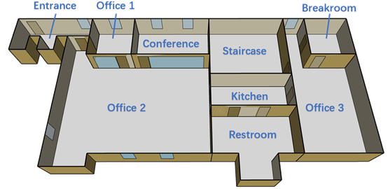
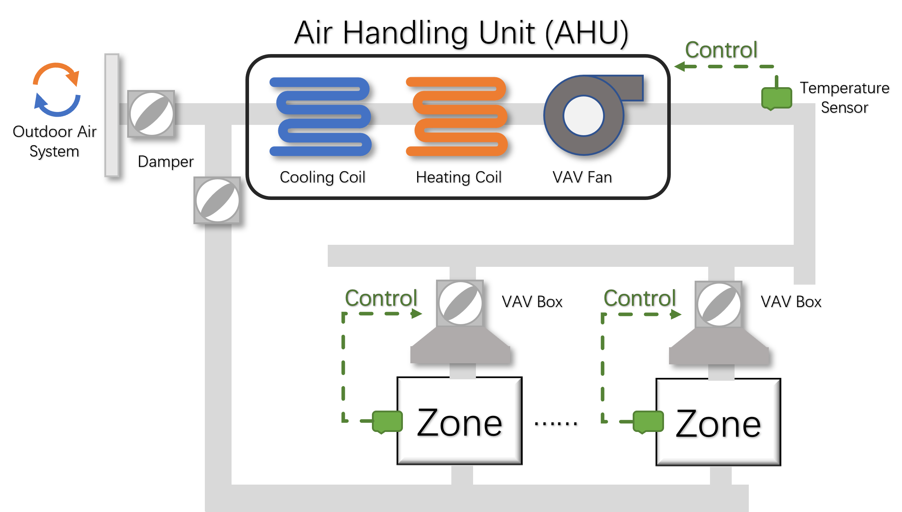
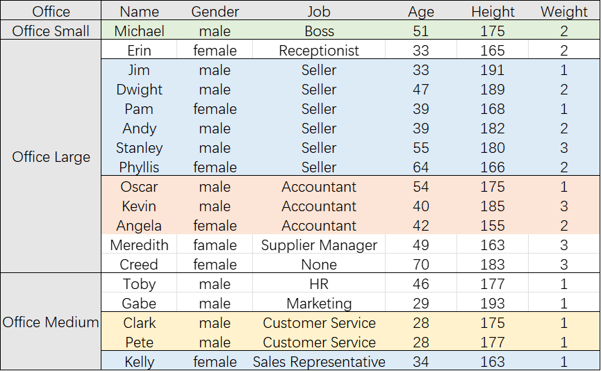
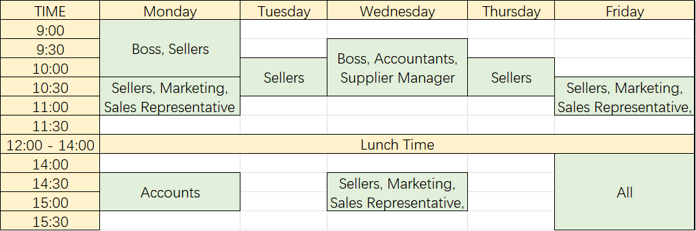

# Co-zyBench

Co-zyBench is a comprehensive benchmark for evaluating thermal comfort provision systems. Co-zyBench is based on a co-simulation approach that is able to realistically simulate both Building Digital Twin for the building and HVAC system, but also Occupant Digital, Twin for the occupants and their dynamic thermal preference response to changes in temperature in different spaces. The benchmark includes a set of metrics that consider energy consumption, thermal comfort, and fairness towards the occupants. Additionally, users can customize the Digital Twins in case they need to do evaluations in their own building or occupant scenarios. More details about this benchmark is included in our paper, we will add our paper here once it gets published. 

## Software Requirement

Currently, Co-zyBench has been tested on Windows 10 and 11 (for other OS we recommend using a Windows virtual machine to ensure compatibility).

To use this benchmark for evaluating thermal comfort provision systems without customizing the building and occupant scenarios, the users just need to install the following tools:  
[Python3](https://www.python.org/downloads/) (version >= 3.8)  
[EnergyPlus 22.2.0](https://github.com/NREL/EnergyPlus/releases/tag/v22.2.0) (version = 22.2.0)  

Note that you need to add the path to EnergyPlus folder (e.g., `C:\EnergyPlusV22-2-0`) to your environment. To verify the setup, execute the command below:
```shell
energyplus -v
```

Python and necessary libraries can be more conveniently installed via [Anaconda](https://www.anaconda.com/). Once Anaconda is set up, open the command line and execute the following command to establish an Anaconda environment using the configuration file `cozybench.yml`. Please be patient, this process could take a few minutes.
```shell
cd path/to/cozybench
conda env create -f ./env/cozybench.yml -n cozybench
```
this command will install Python along with the following libraries: 
[PyFmi](https://jmodelica.org/pyfmi/) (version >= 2.10.3)  
[FMI Library](https://jmodelica.org/FMILibrary/) (version >= 2.4.1)  
[Numpy](https://pypi.org/project/numpy/) (version >= 1.23.5)  
[pandas](https://pypi.org/project/pandas/) (version >= 1.5.3)  
[Scipy](https://pypi.org/project/scipy/) (version >= 1.10.0)  
[lxml](https://pypi.org/project/lxml/) (version >= 4.9.1)  
[Assimulo](https://pypi.org/project/Assimulo/) (version >= 3.4)  
[Cython](https://cython.org/) (version >= 0.29.32)  
[scikit-learn](https://pypi.org/project/scikit-learn/) (version >= 1.2.1)  
[matplotlib-base](https://pypi.org/project/matplotlib/) (version >= 3.7.0)


### Functional Test
After completing the installation steps outlined previously, you can execute our functional test with our sample scenarios to make sure Co-zyBench is working in your machine. These samples are designed to demonstrate the functionality of Co-zyBench and offer users examples to design their scenario and systems. 

Here, we use the sample of a small office building with 18 occupants with different profile created based on a television series [*the office*](https://en.wikipedia.org/wiki/The_Office_(American_TV_series)). The FMU model created based on different city climate (Mumbai, Cairo, Paris, LA, Scranton) are stored in the folder `./models/office/city`. Its floor plan and HVAC system (VAV system) are as shown in the following figures.

<p align="center">
  
  <br>
  <em>Office Building Floor Plan</em>
</p>

<p align="center">
  
  <br>
  <em>VAV System Layout</em>
</p>

Occupants profiles and events are created based on the following information and are stored in the folder `./models/office/trajectories` and `./models/office/occ_config.txt`: 

<p align="center">
    
  <br>
  <em>Occupant Profile</em>
</p>

<p align="center">
  
  <br>
  <em>Event and Occupant Schedule</em>
</p>


Except for the scenarios, we also added sample thermal comfort provision systems - *Majority, Drift and Fairness* as baselines for users to compare with. 

Here we will use *Majority* as the thermal comfort provision system and *the office* as the scenario for the functional test. 
Firstly, go to the root path of Co-zyBench and activate the Anaconda environment:
```shell
cd ./path/to/Co-zyBench
conda activate cozybench
```

then start the evaluations for the majority strategy in our reference scenario in Paris conditions: 
```
python ./main.py -s maj -b ./models/office/Paris/in.fmu -o ./models/office/trajectories -p ./models/office/occ_config.txt
```

Wait for several minutes, Co-zyBench will create a folder `./result/result_XXXXX` when the first evaluation process is done. If you can find the JSON-formatted results in the folder, Cozy-Bench is functioning correctly.  
**Note that** if you just want to do the functional test, it's not necessary to wait for the entire evaluations to complete, as this can take some time. You may interrupt the process with Ctrl+C once you see at least one result in this folder.


## Customizing the Benchmark 

Co-zyBench is designed for evaluating thermal comfort provision systems that takes into account occupant thermal comfort and energy consumption. Additionally, Co-zyBench provides the users with flexibility to customize the scenarios. 

### 1. Thermal Comfort Provision System

For thermal comfort provision systems, some sample systems are available in the `strategy.py` file. In this file, there is a function `get_atc()` to call the strategies automatically with occupants' thermal sensations (from -3 to 3 indicating feeling very cold to feeling very hot) and people's loss for the experienced inequality of the occupants (check our paper for more information). 
```
def get_atc(strategy: str, thermal_sensation: dict, p_loss: dict, ep_output: dict)
```

To help the users develop their systems, Co-zyBench offers data on occupants' thermal comfort, people's loss in case the users want to know how much inequality the occupants have experienced, indoor and outdoor temperature and energy consumption. Users should add their system as a function in the `strategies.py` file. This function should return an aggregated group thermal comfort (between -3 to 3). The next step is to regulate the HVAC system based on the estimated group thermal sensation. Co-zyBench's `generate_set_point()` function in `strategies.py` modulates the current HVAC setpoint by 0.5°C every 10, 15, or 30 minutes, corresponding to the group thermal sensation. Users can adapt this function as needed.

The following Table shows the parameters Co-zyBench provides for developing users' systems:

| **Provided Parameters** |                                           |
|-------------------------|-------------------------------------------|
| thermal_sensation       | thermal sensation of each occupant        |
| p_loss                  | accumulated extra loss of each occupant   |
| indoor_temp             | indoor temperature of current space in °C |
| temp_out                | outdoor temperature in °C                 |
| ec_cooling_coil         | energy consumed by cooling coil in J      |
| ec_heating_coil         | energy consumed by heating coil in J      |
| ec_fan                  | energy consumed by the AHU fan in J       |


### 2. Running simulations 

After adding their own systems into the project, the users can now evaluate their performances on comfort and energy consumption:

```
python ./main.py -s system -b building -o occupant -p profile
```

Here, `system` specifies the chosen thermal comfort provision system(s), defined as a list in case there are more systems to be evaluated. The optional parameter `-b building` is the path to the building FMU model, `-o occupant` and `-p profile` are for occupant trajectory and defined profiles. The reference scenarios of Co-zyBench are stored in the folder `./models` of our repository. For example, to conduct the evaluations in a predefined office building included in the benchmark using the Parisian climate zone, users can run the following command:

```
python ./main.py -s maj -b ./models/office/Paris/in.fmu -o ./models/office/trajectories -p ./models/office/occ_config.txt
```

### Results

The evaluation may take a while, you will find the daily results on thermal comfort, fairness, and energy consumption in the folder ./result. The results are shown in JSON format:
```
{
..
"2023-12-29": {
    "cooling_consumption": 975381990.424281,
    "heating_consumption": 6603621637.116568,
    "itc": {
        "1": 736.0,
        "2": 768.0,
        ...
        },
    "total_itc": 6333.0,
    "equality": {
        "1": -22.526659451659395,
        "2": 62.958621933621814,
        ...
        }
}
}
```
Here is an example of the evaluation result accumulated from January 1st till December 29th, _cooling\_consumption_ and _heating\_consumption_ represent the annual energy usage of cooling and heating systems in joule. _itc_ is the total discomfort experienced by occupants and _equality_ shows the extra loss of each individual.

## Customize scenarios

### requirements

To enable a fair comparison of current and future HVAC control approaches as well as reproducibility, Co-zyBench includes a set of reference scenarios in the ./models folder. Additionally, to enable extensibility (both in terms of adding public new scenarios in the future or testing specific scenarios), Co-zyBench provides the users with an option to customize scenarios.  

If the users need to customize the scenarios with their own building or occupant NGSI-LD models, the following tools are required:  
[EnergyPlusToFMU 3.1.0](https://simulationresearch.lbl.gov/fmu/EnergyPlus/export/userGuide/download.html)  (For creating EnergyPlus FMU)  
[Visual Studio](https://visualstudio.microsoft.com/) (C/C++ compiler and linker for EnergyPlusToFMU)  
[SmartSPEC](https://github.com/andrewgchio/SmartSPEC) (Occupant Simulator)

1. The Building Digital Twin to be imported can be the floor plan of the building in NGSI-LD format. The benchmark integrates the floor plan with the other necessary settings from the default EnergyPlus model and then crates EnergyPlus model for FMU model generation. The steps are: 
   1. Define building outline in [IDF](https://en.wikipedia.org/wiki/Intermediate_Data_Format#:~:text=Intermediate%20Data%20Format%20(IDF)%20files,at%20the%20Mentor%20Graphics%20Corporation.) format. &rarr; 
   2. Translate IDF to NGSI-LD by the tool [IFC2NGSI-LD_parser](https://github.com/SAMSGBLab/Iotspaces-IFC2NGSI-LD_parser) &rarr; 
   3. Create EnergyPlus from NGSI-LD models. This is done with the codes in the folder `./dt_prototype/building/generate_outline.py` &rarr;  
   4. Update EnergyPlus model for FMU model where we developed a script `./ep_configure.py` &rarr;
      ```
      python ep_configure.py path/to/Energy+.idd path/to/energyplus_model
      ```
   5. Generate FMU for co-simulation. This needs to be finished by [EnergyPlusToFMU](https://simulationresearch.lbl.gov/fmu/EnergyPlus/export/userGuide/download.html). Check its documentation for more details.

2. Customizing the Occupant Digital Twins is mainly by using [SmartSPEC](https://github.com/andrewgchio/SmartSPEC), by the following steps:
   1. Define people, events and space information in JSON format for SmartSPEC (check documentation for details) &rarr;
   2. Execute SmartSPEC which will generate a `data.csv` file (an example is included in `./dt_prototype/occupant/data.csv`) &rarr;
   3. This generated trajectory file is so large and traversing it each time to retrieve useful data wastes a lot of time. Therefore, we need to clean up unnecessary data and store the data in different folders separately by using the following script`./dt_prototype/occupant/generate_participant_file.py`. Modify the file path in this script and it will generate a folder with seperated trajectory data like `./model/office/trajectories`.

3. Now you have the necessary models and can run the evaluations like introduced above.

## License

Distributed under the MIT License. See `LICENSE` for more information.