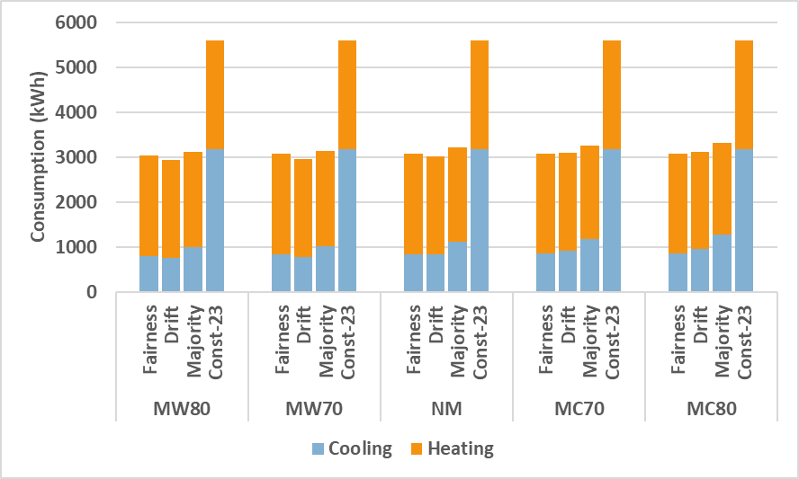

# Introduction 
Because of the limit of the pages, we created this container to contain extra information about the experiments. 

# Experiments with more scenarios.

Except for the experiments and analysis we introduced in the paper, we also execute experiments to evaluate the performance of the four strategies in various scenarios:

**S1: Constant**. This approach maintains the temperature in each zone constant to 23$^\circ C$ since, as explained above, it is observed to be a favorable temperature for a group of people. We chose this strategy since it is a standard approach used in practice in the real world which disregards the presence or the explicit thermal sensation of the occupants of the building.

**S2: Majority Rule**. Various simple decision-making rules can be taken to reach a consensus among the participants (e.g., majority, average, median, etc.). We chose to evaluate the majority rule, usually considered a robust rule since it always satisfies the majority's requirement and maximizes the thermal comfort level of the overall workforce. 

**S3: Drift Approach**. Purdon et al. presents an algorithm that lets occupants vote their thermal sensations using the PMV scale and it aggregates votes by applying different conditions: If the summary of the PMV votes is higher than 0 (or lower than 0) they output a group thermal comfort of 2 (or -2). If the sum is zero, which means that everybody is comfortable, instead of maintaining the current temperature, they apply a *drift* towards the temperature outside of the building for saving energy.
We implement the technique with a small variation: if the average vote is in the -0.5 to 0.5 range, which is considered comfortable, we apply the *drift*. This is done because, in scenarios with multiple diverse people, it is difficult to find situations where their thermal sensation amounts to 0. We chose this strategy because of its focus on providing overall thermal comfort while conserving energy consumption.

**S4: Fairness Approach**. Shin et al. propose an approach to maintain *fairness* among the occupants of a building. In this approach, people accumulate loss when their discomfort is greater than the ideal fair discomfort. Otherwise, they reduce their accumulated loss. For example, if the aggregated thermal sensation is 0, people who feel warm (2 on the scale) get more loss than those who feel slightly warm (1 on the scale). To maintain fairness, the approach takes into account the accumulated loss of each individual in each round and chooses a group thermal comfort value that minimizes the accumulated loss of the individual with the highest loss so far.
We chose this strategy because of its focus on ensuring fairness, or thermal comfort equality in our study when selecting an appropriate thermal sensation value for a group.

## Cities:
We selected five cities all around the world to evaluate the performance of the strategies in different climate zones.

| City     | ASHRAE Climate Zone         | Temperature    | Insulation of External Walls | Conductivity of Windows | Insulation of Roof |
|----------|-----------------------------|----------------|-------------------|------------|---------|
| Mumbai   | CZ 0A - Extremely Hot Humid | 15.6 - 36.0  | 3.4cm             | 2.1W/mK    | 17cm    |
| Cairo    | CZ 2B - Hot Dry             | 6.8 - 41.0   | 4.5cm             | 0.042W/mK  | 21cm    |
| Los      | Angeles CZ 3B - Warm Dry    | 3.9 - 34.4   | 5.6cm             | 0.019W/mK  | 21cm    |
| Paris    | CZ 4A - Mixed Humid         | -5.0 - 34.5  | 6.8cm             | 0.013W/mK  | 21cm    |
| Scranton | CZ 5A - Cool Humid          | -16.7 - 35.6 | 7.9cm             | 0.013W/mK  | 21cm    |

## Thermal Comfort Modeling
In these experiments, we used a very different way to collect occupants' thermal sensations. Firstly, we seperated the occupants into three preference group cold preferred, neutral and warm preferred. The following table show the 5 scenario that modeling majority and minority groups. 

| Scenario               | %cold | %neutral | %warm |
|------------------------|-------|----------|-------|
| No majority (NM)       | 40    | 20       | 40    |
| Majority cold 1 (MC80) | 80    | 0        | 20    |
| Majority cold 2 (MC70) | 70    | 0        | 30    |
| Majority warm 1 (MW80) | 20    | 0        | 80    |
| Majority warm 2 (MW70) | 30    | 0        | 70    |

With the profile and trajectory of each person and the indoor temperature of each space derived from the building simulation, Co-zyBench models the thermal sensation of each occupant based on some pre-defined thermal profiles. For example, if the temperature in a particular zone is 23 degrees, the thermal preference of a person would be, using the standard PMV scale, -1, 0, or 0 depending on whether they prefer warmer temperature, colder temperature, or if their thermal profile is neutral.

## Results
Here, we provide the result of these experiments.

| File                  | Description                                           |
|-----------------------|-------------------------------------------------------|
| trajectory_data.csv   | contains the results of occupant moving trajectories. |
| graphs.xlsx | contains all of the results with graphs |

### Result on Energy Consumption

CZ1 - Mumbai

 

CZ2 - Cairo

  

CZ3 - LA

  

CZ4 - Paris

  

CZ5 - NYC

  

### Result on Individual Thermal Comfort

CZ1 - Mumbai

 

CZ2 - Cairo

  

CZ3 - LA

  

CZ4 - Paris

  

CZ5 - NYC

  

### Result on Thermal Comfort Equality

CZ1 - Mumbai

 

CZ2 - Cairo

  

CZ3 - LA

  

CZ4 - Paris

  

CZ5 - NYC

  

